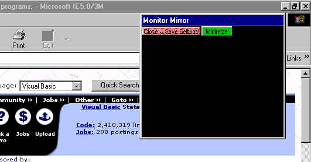



## Monitor Mirror

### Description

Sitting at home on my computer with my back to

the TV ... I thought it would be nice to be able

to sort of keep up on what's happening on TV, so

I whipped up this little monitor mirror. It stays

on top and allows me to see the reflection of

the TV. It's just a black form. Good lesson on

keeping a form on top and retaining settings using

the registry.
 
### More Info
 

             |
---                |---
**Submitted On**   |2002-08-26 10:44:34
**By**             |[Max Seim](https://github.com/Planet-Source-Code/PSCIndex/blob/master/ByAuthor/max-seim.md)
**Level**          |Beginner
**User Rating**    |5.0 (25 globes from 5 users)
**Compatibility**  |VB 5\.0, VB 6\.0
**Category**       |[Complete Applications](https://github.com/Planet-Source-Code/PSCIndex/blob/master/ByCategory/complete-applications__1-27.md)
**World**          |[Visual Basic](https://github.com/Planet-Source-Code/PSCIndex/blob/master/ByWorld/visual-basic.md)
**Archive File**   |[Monitor\_Mi1226848262002\.zip](https://github.com/Planet-Source-Code/max-seim-monitor-mirror__1-38322/archive/master.zip)

